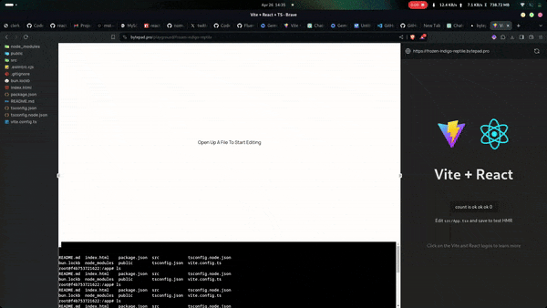

# Bytepad

## Updates

## Important Implementation Details :
- Everything is executed inside a docker container, which creates and isolated sandbox environment for projects.
- No arbitrary / user entered command is ran on the host machine.
- Used Nginx proxy to map `*project-id.bytepad.pro` to the port which is running the project with the project ID to  preview of the currently running web app.
- Every endpoint is behind auth, only authenticated users can create projects, view projects they are a part of, delete.
- Multiple user support, as every project is containerized, multiple users can work on the same project without any conflicts.

## TechStack:

### Frontend :
The project frontend is built with React, combined with several other libraries like Monaco Editor, Xterm.js , SWR, Tailwind CSS and Scoket.io

### Backend :
Built with Express + NodeJS , Docker , Docker Engine API, Nginx, Socket, AWS and Proxies

## Flow :
- User creates a project
- New project is created with a template repository within S3
- The remote files are downloaded locally and is mounted to a newly created `oven/bun` docker container.
- The container gets a random port assigned to it which is mapped to port 3000 (Every project runs on port 3000 inside the docker container).
- The project is now live and running
- The user hits an URL `id.bytepad.pro`, which goes through a proxy to the port where the project is running.

## Architecture:
 The project is seperated into three main parts, the **Frontend** , the **Proxy Server** and **Main Backend**, 

 Only the proxy server is exposed to the internet, the Backend + MySQL DB + Redis is inside the same private network as the proxy server and has no direct access to internet.

 The proxy server is responsible for routing the requests to the correct destination.

 If a request comes with the host `api.bytepad.pro` the proxy server will route the request to the main backend.
 
 If a request comes with the host `*wildcard.bytepad.pro` the proxy server will get the port the container is running on from Redis and route the request to the correct port.

If a request comes to `terminal.bytepad.pro` the proxy server will route the request to the docker socket which in running in the Unix system. So that Xterm in the frontend can attach to this websocket. Which will be used to run the terminal in the browser. This runs commands directly inside the container and we hav e to handle 0 fuss for running the terminal by ourselves.

## Running IOS/Android Applications :
Hybrid applications usign React Native and Expo can be eaily run on the platform. How they achieve this on [Expo Snack](https://snack.expo.dev/) is, they user [Appetize](https://appetize.io/) to provide users with an emulator with a single app installed : Expo Go. Now the best part is Expo Go runs apps through URL, so we can easily run the app on the emulator by providing the URL of the app. This can be easily implemented in the platform. But there are some things to take in consideration, like exposing multiple ports for The Expo Developer Tools and React Native Packager. I already tried building this and it is running perfectly when not inside  a docker container. But when inside a docker container there are few things to take care of.

